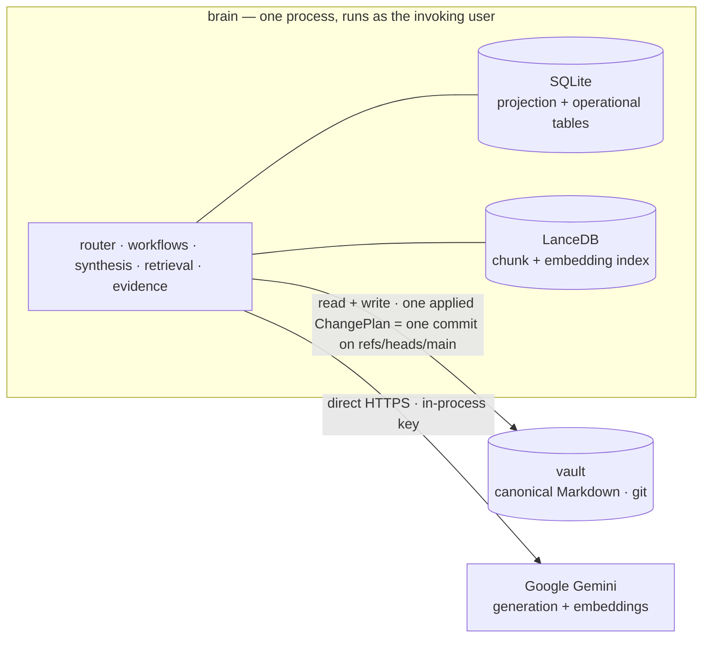

<!--
  Root README — the public face of Atlas. Keep claims verifiable in-repo
  (real paths, real commands, real PR numbers). Playground posture: no semver,
  no badges, honest about being a personal project. v2 (ADR-0003): single
  process, git is the only safety mechanism.
-->

# Atlas

**The LLM-native second-brain wiki engine.** A pnpm/TypeScript monorepo whose CLI binary is `brain`.

Atlas is **one process** on top of a git-backed Markdown vault plus a vector DB: it opens the vault working tree, the SQLite projection, and the LanceDB index, retrieves and rewrites notes, commits to git, and exits. The LLM is a *reasoning component, not the database* — every model-authored change is grounded, validated, and applied as exactly one git commit.

> Markdown is the memory. SQLite is the operational projection. LanceDB is the retrieval projection. **Git is the only safety mechanism** — one commit per applied ChangePlan is both the audit trail and the undo.
> — [`docs/adr/0003-retire-security-architecture.md`](docs/adr/0003-retire-security-architecture.md)

**Two classes of state, deliberately never conflated:**

- **Vault-derived projections** — `notes`, `sections`, `links`, `evidence`, chunk metadata (SQLite) + the chunk/embedding index (LanceDB). Deterministically **rebuildable from canonical Markdown** at any time (`brain db rebuild` / `brain index rebuild`). Disposable.
- **Operational tables** — `jobs` / `job_attempts`, the `source` registry, `model_calls`, `agent_runs` (SQLite). **Not** vault-derived; **retained** across `db rebuild`. Losing them loses history, not correctness.

The vault is the artifact you keep. Everything else you can throw away and regenerate.

---

## Why it exists

Atlas began as a security-first, contract-first, fail-closed exercise — privilege-separated brokers, scan-before-persist, a signed audit ledger, biometric authorization. That fortress became the reason the *actual product* couldn't move: every agentic experiment paid a broker round-trip, a capability mint, and a scan gate before it could touch a note.

**v2 tore the fortress down** ([ADR-0003](docs/adr/0003-retire-security-architecture.md), [spec](docs/specs/2026-07-21-atlas-v2-single-process-simplification-spec.md)). The threat model the fortress defended — hostile multi-tenant egress, untrusted contributors, credential exfiltration — does not exist for a single operator on a single machine editing their own vault. What remains is the agentic core: **getting, fetching, rewriting, enhancing, and relating notes.**

**Safety collapses to git.** One commit per applied ChangePlan, so `git revert <sha>` followed by `brain sync` is the undo, and `git log` / `git blame` is the audit trail. A bad or buggy write is recovered from history, not prevented by a wall.

This is a **playground, not a product** — a personal project. No semver, no compatibility promises, no rollout ceremony. That posture is honest, not licence to be sloppy.

---

## Headline capabilities

- **Ingest** local sources (`markdown` / `text` / `pdf` / `html`) — `normalize()` parses in-process into notes.
- **Hybrid retrieval** — a deterministic section chunker + Gemini embeddings in LanceDB, fused with a stemmed/stop-word FTS index via reciprocal-rank fusion; `brain query` returns a grounded, cited answer.
- **Model-authored synthesis** — `enrich` / `maintain` run retrieve → LLM plan (`generateObject<ChangePlan>`) → validate → ground → apply, producing **exactly one commit** touching only the ChangePlan's paths.
- **Typed relationships** — `link` fronts `CreateRelationship` (typed edge, stored in the source note's frontmatter `related:` list) and `SetLink` (a plain body `[[wikilink]]`).
- **Evidence** — `evidence review` / `retry` / `resolve` over a vault-derived projection folded from each note's frontmatter `evidence:` block.
- **Reconcile** — `brain sync` diffs the working tree against the SQLite projection by per-note content hash (the hash **is** the cursor) and reindexes the delta; `db rebuild` regenerates the whole vault-derived projection from Markdown.

Provider: Google **Gemini** — `gemini-3.5-flash` (generation), `gemini-embedding-001` (embeddings, 768-dim). A direct in-process client; the key resolves lazily from `ATLAS_GEMINI_API_KEY` (env override wins) else the macOS Keychain item `atlas-gemini-api-key`, held in-process only.

---

## Architecture

Eight workspace packages + one app + the CLI-contract harness. **No daemons, no OS identities, no privilege boundary except git.** `brain` runs as you.



**Packages** (all `private`, `0.0.0`, ESM/NodeNext, strict TS):

| Package | Role |
|---|---|
| [`apps/cli`](apps/cli/CLAUDE.md) (`@atlas/cli`) | The `brain` binary: registry-driven router, the 24 command handlers, the workflow/synthesis/retrieval/evidence engine, terminal-safe renderer. |
| [`packages/contracts`](packages/contracts/CLAUDE.md) | Zero-dep-besides-zod leaf: canonical serialization (`atlas-jcs-v1`), stable IDs, the **12-op** ChangePlan catalog (`CHANGE_PLAN_OPS`, incl. `CreateRelationship`/`SetLink`), identity-key algorithm, shared DTOs. |
| [`packages/sources`](packages/sources/CLAUDE.md) | The md/txt/pdf/html normalizers — `normalize()` parses **in-process** (the sandbox jail is retired). |
| [`packages/sqlite-store`](packages/sqlite-store/CLAUDE.md) | Persistence core: the migration runner + the deterministic projection rebuild-from-vault. |
| [`packages/lancedb-index`](packages/lancedb-index/CLAUDE.md) | Deterministic chunker + embedding write path + hybrid search + FTS index + the recall@10/MRR eval harness. |
| [`packages/models`](packages/models/CLAUDE.md) | The in-process Gemini client: lazy env→Keychain key resolution, `model_calls` persistence, the prompt registry. Per-call token cap. |
| [`packages/git`](packages/git/CLAUDE.md) | Typed git plumbing — commits an applied ChangePlan's touched paths onto `refs/heads/main`. |
| [`packages/jobs`](packages/jobs/CLAUDE.md) | SQLite-backed durable queue — sole owner of `jobs` / `job_attempts`. |
| [`packages/testing`](packages/testing/CLAUDE.md) | The `withFixtureVault` harness (a fixture vault in a throwaway git repo). |
| [`tools`](tools/CLAUDE.md) | The retained CLI-contract harness: registry SSOT, drift generators, the mega-lint. |

---

## The safety model

Not a fortress — **git**. There is no privilege boundary beyond git history, by design ([ADR-0003](docs/adr/0003-retire-security-architecture.md)).

- **One commit per ChangePlan.** Every mutation follows the canonical order in [`apps/cli/src/workflows/mutation-order.ts`](apps/cli/src/workflows/mutation-order.ts): take the vault lock → assert `HEAD == refs/heads/main` → validate the ChangePlan → ground it against the projection → capture the touched-path preimage → apply to the working tree → commit **only** the ChangePlan's paths → refresh LanceDB, then the SQLite projection → release. A thrown error restores the preimage.
- **The projection content-hash IS the sync cursor.** No `head` marker, no canonical-ref indirection — the canonical ref *is* `refs/heads/main`. A crash after the commit leaves the projection stale; the next `brain sync` heals it structurally.
- **Dirty-vault doctrine.** Reads and `sync` treat a dirty tree as normal input. A mutating command tolerates *unrelated* dirt but fails grounding (exit 1) if any note it edits or names is dirty — dirty being an on-disk hash ≠ projection `content_hash`, **or** an uncommitted git diff vs `HEAD`.
- **Remediation is git.** Undo a bad write with `git revert <sha>` **then** `brain sync` (the revert restores the tree; the sync refolds the derived stores). `git log` is the audit trail.

**Named, accepted residual risks** (playground tier — a multi-tenant deployment would not accept these):

- **Direct writes to the real brain** — no broker mediates, no ledger signs. Mitigated only by one-commit-per-ChangePlan reverts.
- **Unsandboxed ingest** — externally-sourced PDF/HTML bytes are parsed in-process with the operator's privileges and are **not** secret-scanned. Unmitigated by design; the only control is the operator choosing what to ingest.

The retired fortress (brokers, OS identities, scan engine, signed ledger, graduation, authorization signer, Console) is revivable from the **`v1-fortress`** annotated tag — code + provisioning only, not migrated data. See [ADR-0003](docs/adr/0003-retire-security-architecture.md).

---

## Quickstart

Requires **Node ≥ 24** (CI runs 26) and **pnpm ≥ 11**. Dependency versions are pinned centrally via `catalog:` in `pnpm-workspace.yaml`. **macOS is the supported target** (the Keychain read is macOS-only; the env-var key override works anywhere).

```bash
git clone git@github.com:21StarkCom/Atlas.git
cd Atlas
pnpm install --frozen-lockfile
pnpm -r build                            # tsc per package
pnpm -r test                             # vitest per package — zero provisioning, no daemons
node tools/gen-cli-contract.ts --check   # command-registry drift gate

# point the config at your vault, then build the stores
cp brain.config.example.yaml brain.config.yaml   # set vault.path (defaults to ~/Code/Vaults/main-vault)
alias brain="node $PWD/apps/cli/dist/bin.js"

brain db migrate       # create the SQLite DB + apply all migrations (sole migration composition root)
brain db rebuild       # regenerate the vault-derived projection from Markdown
export ATLAS_GEMINI_API_KEY=…            # or store it in the Keychain (service atlas-gemini-api-key)
brain index rebuild    # chunk → embed → write the LanceDB retrieval index

brain query "who runs the Cloud team"    # grounded, cited answer
brain enrich <note> --apply              # model-authored synthesis, one commit
brain link <source> <target> --predicate cites   # a typed relationship in source's frontmatter
```

`vault.path` defaults to `~/Code/Vaults/main-vault` ([`apps/cli/src/config/schema.ts`](apps/cli/src/config/schema.ts) `DEFAULT_VAULT_PATH`). To pin the intended target and fail-closed on a stale override, export **`ATLAS_EXPECT_VAULT=<vault>`** — `loadConfig` canonicalizes both it and `vault.path` and refuses (exit 2) any mismatch. The full cold-start runbook is [`docs/install.md`](docs/install.md).

---

## Command surface

`brain` exposes **24 commands** driven by a single registry SSOT (`docs/specs/cli-contract/commands.json`, version 2 — the #333 survivor set, shrunk 55 → 24). The full generated list with args, flags, exit codes, and side-effects is [`docs/specs/cli-contract/commands-overview.md`](docs/specs/cli-contract/commands-overview.md). A curated tour by domain:

| Domain | Commands | Notes |
|---|---|---|
| **Inspect** | `status` · `note show/related/history` | `status` merges the old `doctor` + `db status` + `index status` + `sync status`; `checks[]` = `vault-reachable`, `git-healthy`, `provider-key-present`, `index-not-stale`, `migrations-current`. Exits 0 even when a probe fails (`ok:false` is data). |
| **Notes & links** | `note add` · `link` | `link` fronts `CreateRelationship` (`--predicate`, stored in frontmatter `related:`) and `SetLink` (plain `[[wikilink]]`); `--remove` and `--alias` per the schema. |
| **Ingest & sources** | `ingest` · `source add/list/show` | `source` is an operational registry; `ingest` normalizes a source's bytes into notes. |
| **Query & index** | `query` · `index rebuild` · `index eval` | `index rebuild` absorbs the old `repair`/`status`/`verify`; `index eval` is the retrieval gate. |
| **Synthesis** | `enrich` · `maintain` · `validate` | Model-authored, retrieval-first; mutate only with `--apply`. |
| **Evidence** | `evidence review/retry/resolve` | Over a vault-derived projection folded from note frontmatter. |
| **Sync & persistence** | `sync` · `db migrate` · `db rebuild` | `sync` reconciles the working tree vs projection by content hash; `db migrate` is the sole migration composition root. |
| **Jobs** | `jobs run` · `jobs list` | Durable single-runner queue; `jobs run` emits `{items, aggregate}`. |

**Global conventions:** every command supports `--json` (one NDJSON envelope), `--plain`/`--quiet`/`--verbose`, `--config <path>`. Output is terminal-injection-safe by construction (all CSI/OSC/bidi stripped). Exit codes: `0` ok · `1` validation · `2` config/vault/lock · `4` internal · `5` usage. *(The single error envelope carries `retryable`/`retryAfterMs` at exit 4; only the `jobs run` batch aggregate can return `7`. The old secret-scan `3` and action-required `6` codes retired with the security architecture — no command emits them.)*

---

## Project status

**Six PR-gated V1 phases, then the v2 single-process pivot.** V1 shipped the full security fortress and drove a real vault end-to-end (2026-07-17: **210 notes graduated, 0 refused**; `index eval` clears the gate at **recall@10 0.911 / MRR 0.830** on the default hybrid config; thresholds ≥ 0.85 / ≥ 0.70). **v2** ([ADR-0003](docs/adr/0003-retire-security-architecture.md)) retired the entire security architecture in place:

| Kept (v2) | Retired (revivable from `v1-fortress`) |
|---|---|
| Note model + the 12-op ChangePlan | The integration + egress brokers, all three OS identities, provisioning daemons |
| Plain SQLite projection + `db rebuild` | `@atlas/scan`, scan-before-persist, quarantine, trust tiers + taint |
| LanceDB retrieval + the eval gate | The signed audit ledger, the cross-store write protocol, encrypted backup/restore |
| Synthesis + evidence (the agentic layer under test) | Graduation, authorization challenges + capabilities + budgets |
| Direct in-process Gemini client | The absorb-cycle sync + canonical-ref indirection |
| Minimal SQLite-backed jobs queue | The Atlas Console + the authorization signer + `brain watch` |

The command surface dropped **55 → 24**; exit codes `3` and `6` retired; `@atlas/broker` and `@atlas/scan` are deleted. `v1-fortress` is the sole revival path (code + provisioning only).

---

## Documentation

Docs live with the code under `docs/`, folder-per-type. Start with the [root constitution](CLAUDE.md); each package carries its own `CLAUDE.md` with operational truth the code can't show.

- **The v2 decision** — [`docs/adr/0003-retire-security-architecture.md`](docs/adr/0003-retire-security-architecture.md) (supersedes ADR-0001 + ADR-0002) + [`docs/specs/2026-07-21-atlas-v2-single-process-simplification-spec.md`](docs/specs/2026-07-21-atlas-v2-single-process-simplification-spec.md)
- **CLI contract** — [`docs/specs/cli-contract/`](docs/specs/cli-contract/) (registry `commands.json` version 2 + one JSON schema per command + generated overviews)
- **V1 design SSOT** — [`docs/specs/2026-07-11-atlas-v1-design.md`](docs/specs/2026-07-11-atlas-v1-design.md) (superseded by the v2 spec + ADR-0003; historical)
- **Install runbook** — [`docs/install.md`](docs/install.md) (clone → build → point config → migrate/rebuild/index)
- Full doc map + conventions: [`docs/CLAUDE.md`](docs/CLAUDE.md).

---

## Development workflow

- **Contract-first.** `docs/specs/cli-contract/commands.json` is the single owner of command membership/phase/privilege/idempotency. `node tools/gen-cli-contract.ts --check` gates surface drift in CI; `tools/contract-lint.test.ts` enforces the registry↔fixture↔schema bijection. Generated docs are never hand-edited.
- **CI** ([`.github/workflows/ci.yml`](.github/workflows/ci.yml)) — **zero-provisioning, daemon-free**: `ubuntu-latest` + `macos-15`, Node 26: `pnpm install --frozen-lockfile` → `pnpm -r build` → `pnpm -r test` → the contract-drift `--check`. The ubuntu leg is a portability canary for the platform-neutral suite (macOS is the supported target).
- **Test live.** Local verification isn't enough for anything touching the real Gemini surface — exercise it. Every high-value bug in the trail surfaced only against the real corpus, never synthetic fixtures.
- **Branch + PR for everything.** No direct-to-main; commits authored `Aryeh Stark <aryeh@21stark.com>`. Merge once the PR is green — playground posture, no soak/canary. Docs update in the same change as the behavior they describe.

Agents working in this repo read [`AGENTS.md`](AGENTS.md); the [root `CLAUDE.md`](CLAUDE.md) is the full constitution.
