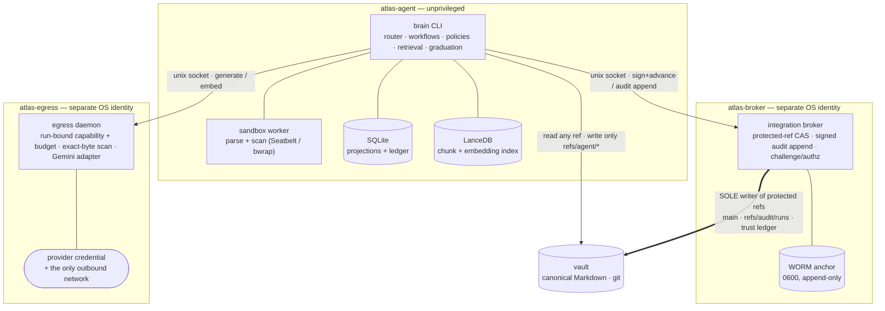

<!--
  Root README — the public face of Atlas. Keep claims verifiable in-repo
  (real paths, real commands, real PR numbers). Playground posture: no semver,
  no badges, honest about being a personal project.
-->

# Atlas

**The LLM-native second-brain wiki engine.** A pnpm/TypeScript monorepo whose CLI binary is `brain`.

Atlas treats a git-backed Markdown vault as the **durable memory** and everything else as derived state. The LLM is a *reasoning component, not the database* — every model-authored change is captured, validated, and integrated through a privilege-separated safety spine before a single byte lands in the vault.

> Markdown is the memory. SQLite is the operational projection. LanceDB is the retrieval projection. Git is the safety/audit mechanism.
> — [`docs/specs/2026-07-11-atlas-v1-design.md`](docs/specs/2026-07-11-atlas-v1-design.md)

**Two classes of state, deliberately never conflated:**

- **Vault projections** — `notes`, links, identity keys, provenance, claims (SQLite) + the chunk/embedding index (LanceDB). Deterministically **rebuildable from canonical Markdown** at any time (`brain db rebuild` / `brain index rebuild`).
- **Operational / audit ledger** — `agent_runs`, `audit_events`, backup watermark, `model_calls`. **Primary state, NOT rebuildable from Markdown** — recovered only from the encrypted ledger backup, tamper-evidenced by a signed `refs/audit/runs` chain and a WORM anchor.

The vault is the artifact you keep. The projections you can throw away and regenerate; the ledger you protect with backups.

---

## Why it exists

Handing an agent write access to your knowledge base is a trust problem, not a prompt problem. Atlas answers it structurally:

- **The CLI holds no dangerous capability.** It can't write a protected git ref, can't hold the provider credential, can't reach the network. Those live behind two separate OS identities.
- **Raw model output never becomes a file.** Synthesis is retrieval-first, validated against a deterministic risk/mutation policy, scanned for secrets, and integrated by the broker as a persisted, crash-safe workflow.
- **Nothing is best-effort.** Secret scanning, the backup watermark, the graduation gate, and rollback all **fail closed** — a missing guarantee refuses the operation instead of degrading it.

This is a **playground, not a product** — a personal project built to a production-grade security bar for the exercise, not shipped to anyone. No semver, no compatibility promises, no rollout ceremony.

---

## Headline capabilities

- **Ingest** local sources (`markdown` / `text` / `pdf` / `html`) through a per-host OS sandbox (macOS Seatbelt, Linux bwrap+seccomp+cgroup) that parses and secret-scans **inside the jail** and hands back an attested-clean stream — never a path.
- **Hybrid retrieval** — a deterministic section chunker + Gemini embeddings in LanceDB, fused with a real stemmed/stop-word FTS index via reciprocal-rank fusion; `brain query` returns a grounded, cited, audited Tier-0 answer.
- **Model-authored synthesis** as a persisted state machine (`planned → patched → worktree-applied → agent-committed → [review-pending] → integrated → reindexed → finalized`) with one atomic write per transition and full crash recovery.
- **Graduation** — bring a *real* vault onto Atlas: full working-tree + git-history secret scan → audit → deterministic byte-exact migrate plan → resumable apply/rollback.
- **Disaster recovery** — AEAD-encrypted ledger backups with a fail-closed watermark; `db restore`; `db rebuild --from-git` reconstructs projections from canonical Markdown.
- **GDPR-style erasure** (`brain purge`) with audit-ref reconciliation (tombstone, never orphan).

Provider: Google **Gemini** — `gemini-3.5-flash` (generation), `gemini-embedding-001` (embeddings, 768-dim). The adapter is broker-internal and provably non-mutating.

---

## Architecture

Ten workspace packages + one app + the contract harness + host provisioning, split across three trust boundaries. The `brain` CLI is unprivileged; the two brokers each run as a distinct OS identity.



**Packages** (all `private`, `0.0.0`, ESM/NodeNext, strict TS):

| Package | Role |
|---|---|
| [`apps/cli`](apps/cli/CLAUDE.md) (`@atlas/cli`) | The `brain` binary: registry-driven router, ~50 command handlers, the workflow/policy/trust/graduation/retrieval/quarantine/purge engine, terminal-safe renderer. |
| [`packages/contracts`](packages/contracts/CLAUDE.md) | Zero-dep (Zod-only) process-seam leaf: canonical serialization (`atlas-jcs-v1`), stable IDs, the ChangePlan op catalog, identity-key algorithm, audit/authorization Zod mirrors. Byte-identity across the CLI↔broker seam is *the* contract. |
| [`packages/broker`](packages/broker/CLAUDE.md) | Both privileged daemons — integration broker (protected-ref CAS, WORM audit) + egress broker (credential, network, exact-byte scan, budget). Never imports the ledger. |
| [`packages/sqlite-store`](packages/sqlite-store/CLAUDE.md) | Persistence core: checksum-guarded gap-tolerant migrations, transactional projection rebuild, the 4-step cross-store ledger write protocol, AEAD backup/restore. |
| [`packages/lancedb-index`](packages/lancedb-index/CLAUDE.md) | Deterministic chunker + generation-fenced write path + hybrid search + FTS index + the recall@10/MRR eval harness. |
| [`packages/scan`](packages/scan/CLAUDE.md) | Fail-closed secret-detection leaf: one versioned ruleset, two quarantine-before-throw guards. |
| [`packages/sources`](packages/sources/CLAUDE.md) | The OS-jailed parser worker + per-format normalizers (scan-before-persist). |
| [`packages/models`](packages/models/CLAUDE.md) | CLI-side typed IPC client for the egress broker + capability minting + `model_calls` ledger persistence. Holds no credential. |
| [`packages/jobs`](packages/jobs/CLAUDE.md) | SQLite-backed single-runner durable queue (idempotent enqueue, atomic claim, full-jitter backoff, cross-process cancel). |
| [`packages/git`](packages/git/CLAUDE.md) | Typed git plumbing for the agent side — makes protected-ref writes *structurally impossible* (`runGit` unexported). |
| [`packages/testing`](packages/testing/CLAUDE.md) | The `withFixtureVault` harness. |
| [`tools`](tools/CLAUDE.md) | The retained CLI-contract harness: registry SSOT, drift generators, the mega-lint. |
| [`provisioning`](provisioning/CLAUDE.md) | The one human/`sudo` step: OS identities, key custody, WORM anchor, sockets, sandbox prerequisites. |

---

## The security model

Not a feature — the reason the project exists. Six load-bearing mechanisms:

- **Privilege separation.** Three OS identities: `atlas-agent` (the CLI + parser + workflow, network-denied at the UID), `atlas-broker` (sole protected-ref mutator + sole audit-append signer + WORM anchor), `atlas-egress` (sole provider-credential holder + sole outbound-network process, *no vault access*). The attestation key never leaves the broker; every canonical git move is broker-signed under a service-wide mutation lock.
- **Fail-closed secret scanning.** One deterministic, versioned engine ([`packages/scan`](packages/scan/CLAUDE.md)) runs at every boundary — ingest, sandbox output, generated artifacts, graduation (working tree **and** full git history), and egress (both directions). A dirty verdict quarantines the bytes *before* the abort unwinds and returns exit 3. No allowlist, no suppression.
- **WORM audit anchor.** `refs/audit/runs` is a signed, gapless, chained event stream; a `0600` append-only anchor binds the chain head to its exact position, so truncate-then-append and rewrite-then-append are both detectable. The broker re-verifies the whole chain at startup.
- **Capability-key egress.** Every model call carries a short-lived, run-bound capability (HMAC over `{runId, operation, model, maxBytes/tokens, costCeiling, sensitivity, expiry}`) plus a per-run byte/token/cost budget the egress daemon enforces. The CLI mints; the daemon verifies against the same secret.
- **Trust tiers + taint.** Sources carry trust (untrusted by default); taint is transitive by floor, never averaged; sensitivity is most-restrictive on read. Risk is a deterministic function of `operation × targetType × scope × config`, monotonic-upward — **Tier-3 changes require human review**.
- **Challenge/authorization for privileged mutations.** `db restore`, `purge`, `graduation migrate --apply`, `git approve/rollback`, `source trust promote/revoke`, `quarantine resolve` all follow `--export-challenge` → sign out-of-band → `--authorization`. **`--yes` never authorizes anything** — it is explicitly documented as inert. The broker independently re-derives risk/policy/trust from the candidate tree; any mismatch escalates to Tier-3.

**Graduation** is the security model applied to onboarding: a real vault is scanned, audited, and migrated by a **byte-exact, deterministic, resumable** pipeline that refuses to proceed without a clean recorded scan and hard-fails on a history-only credential even with a working-tree handshake.

One [ADR](docs/adr/0001-egress-response-scan-released-bytes.md) governs a subtle egress corner: the response-direction scan runs on the *released* serialized result, not the raw provider envelope — because Gemini's opaque per-response `thoughtSignature` is byte-indistinguishable from a secret and refused every generated answer until [ADR-0001](docs/adr/0001-egress-response-scan-released-bytes.md).

Full contract: [`docs/specs/security-broker-contract.md`](docs/specs/security-broker-contract.md).

---

## Quickstart

Requires **Node ≥ 24** (CI runs 26) and **pnpm ≥ 11**. Dependency versions are pinned centrally via `catalog:` in `pnpm-workspace.yaml`.

```bash
git clone git@github.com:21StarkCom/Atlas.git
cd Atlas
pnpm install --frozen-lockfile
pnpm -r build          # tsc per package; @atlas/sources must build before its worker runs
pnpm -r test           # vitest per package (in-process/local subset without provisioning)
node tools/gen-cli-contract.ts --check   # command-registry drift gate
```

That builds and runs the local test subset. **Exercising the real security spine** — the two-UID broker/egress separation, file-based key custody, WORM anchor, sandbox containment — needs host provisioning (a `sudo` step) and `ATLAS_PROVISIONED=1`. The complete provision → run-a-broker → drive-a-vault runbook, including the live-drive gotchas, is in **[`docs/install.md`](docs/install.md)**.

---

## Command surface

`brain` exposes **55 commands** across 5 phases, driven by a single registry SSOT (`docs/specs/cli-contract/commands.json`, version 1). The full generated list with args, flags, exit codes, and side-effects is [`docs/specs/cli-contract/commands-overview.md`](docs/specs/cli-contract/commands-overview.md). A curated tour by domain:

| Domain | Commands | Notes |
|---|---|---|
| **Inspect** | `inspect` · `doctor` · `status` · `note show/related/history` | Diagnostic reads stay available even when writes are blocked. |
| **Ingest & sources** | `ingest` · `source add` · `source list/show` · `source trust show/promote/revoke` | Scan-before-persist; preview unless `--apply`. |
| **Query & index** | `query` · `index status/verify/repair/rebuild/eval` | `query` is an audited Tier-0 grounded answer; `index eval` is the retrieval graduation gate. |
| **Synthesis** | `enrich` · `reconcile` · `maintain` · `validate` | Model-authored, retrieval-first, non-mutating previews unless `--apply`. |
| **Git review (Tier-3)** | `git status/verify/review/approve/reject/rollback/refresh/cleanup` | The human review loop; `approve`/`rollback` are broker-authorized. |
| **Graduation** | `graduation scan/audit/migrate` · `quarantine inspect/resolve` | Fail-closed, byte-exact, resumable. |
| **DB / DR** | `db status/verify/migrate/rebuild/backup/restore` | `db migrate` is the sole migration composition root; `db restore` is privileged. |
| **Jobs** | `jobs list/run/retry/cancel` | Durable single-runner queue; batch commands emit `{items, aggregate}`. |
| **Vault sync (60-B)** | `sync` · `sync status` · `sync reset` | One-way absorb of the adopted vault's upstream into `refs/atlas/main`: scan-before-persist, delete→archive, OQ#5 divergence REJECT-halt, O(delta) `index:reconcile` enqueue. `sync reset` is the privileged, broker-authorized tree-reconcile recovery from a divergence/exit-3 halt (accepts + audits a history gap). |
| **Evidence & purge** | `evidence review/retry/resolve` · `purge` | `purge` is authorize-first, one transaction, post-purge verified. |

**Global conventions:** every command supports `--json` (one NDJSON envelope), `--plain`/`--quiet`/`--verbose`, `--config <path>`. Output is terminal-injection-safe by construction (all CSI/OSC/bidi stripped). Exit codes: `0` ok · `1` validation · `2` config/vault/lock · `3` secret-scan · `4` internal · `5` usage · `6` action-required. *(The contracts name a nominal exit 7 "provider-retryable"; a single-command run expresses retryability as a `retryable` flag on the exit-4/6 envelope, and only the `jobs run` batch aggregate can actually return exit 7.)*

---

## Project status

**Six PR-gated phases, all complete** (~96 commits, issues/PRs #1–#161). Each phase opened with a *contracts gate* PR that landed the normative spec + JSON schemas before any feature code.

| Phase (tracker) | Delivered | PRs |
|---|---|---|
| **0 — Scaffold + contracts** (#3) | Monorepo, CI matrix, retained CLI-contract harness, the design SSOT + phase-1 schemas, fixture vaults | #61 |
| **1 — Foundation** (#4) | Contracts, config, vault reader, sqlite-store core, `@atlas/git`, CLI foundation, provisioning, the broker trio + ledger DR | #62–#64, #66 |
| **2 — Ingest loop** (#5) | Scan engine + guards, sandboxed parser, workflow state machine, durable queue, egress broker + `@atlas/models`, ingest capture | #67, #71–#79 |
| **3 — Retrieval** (#6) | Chunker + generation fence, embedding write path, hybrid search + RRF, `brain query`, index ops + eval harness | #68, #80–#85 |
| **4 — Workflows** (#7) | Patch engine, risk/mutation policy, validation, synthesis plan/apply/refresh, trust, purge, the Tier-3 git review lifecycle | #69, #86–#141 |
| **5 — Graduation** (#8) | Graduation scan/audit/migrate, quarantine, scan ruleset v2, the open type system, the full-corpus live index build + eval gate | #70, #99–#161 |

### The 2026-07-17 full-corpus live drive

The graduation + retrieval pipeline run end-to-end against a **real** vault ([retro](docs/retros/2026-07-18-search-index-live-drive-retro.md), the authoritative account):

- **Graduation apply** (operator-signed, D20): **210 notes, 0 refused, 0 quarantined, 3 renames** — the live `main-vault` HEAD never touched.
- **Index rebuild**: **199 notes → 1,647 chunks** with real Gemini embeddings in **85 s** (10 empty title-only stubs correctly left unactivated). `index rebuild` ×2 → byte-identical output — determinism proven.
- **Eval gate** (thresholds **recall@10 ≥ 0.85, MRR ≥ 0.70**): at drive time the gate passed **0.878 / 0.784** on the vector-only fallback, because no FTS index had been built and brute-force lexical matches flooded top-K. **#159 built a real stemmed/stop-word inverted index**; the default **hybrid config now scores 0.911 / 0.830** — hybrid is the recommended default, no fallback.

### Open

Two issues remain open, both real but non-blocking:

- **#60** — graduation E2E remaining slices (workflow runs on the migrated copy, purge E2E across every storage class, the `tools/scale-bench.ts` 5k/50k profiles + CI regression subset). The retrieval-eval and rebuild-consistency slices are done.
- **#65** — ledger/backup disaster-recovery hardening residuals from the #23 review (seq-allocator rewind on older-cut restore, universal-startup restore recovery, deleted-DB restore, watermark coverage under concurrent backup, retry backoff, force-unblock without the AEAD key).

---

## Documentation

Docs live with the code under `docs/`, folder-per-type. Start with the [root constitution](CLAUDE.md); each package carries its own `CLAUDE.md` with operational truth the code can't show.

- **Design SSOT** — [`docs/specs/2026-07-11-atlas-v1-design.md`](docs/specs/2026-07-11-atlas-v1-design.md) (capability + scope + architecture; the `In V1 / Out of V1` list is normative)
- **Implementation plan** — [`docs/plans/atlas-v1-implementation-2026-07-12.md`](docs/plans/atlas-v1-implementation-2026-07-12.md) (six phases, decisions D1–D20, §2.7 migration ownership, §2.8 cross-store write protocol)
- **Contract specs** — `docs/specs/*.md`: [security-broker](docs/specs/security-broker-contract.md), [retrieval-index](docs/specs/retrieval-index-contract.md), [jobs](docs/specs/jobs-contract.md), [sandbox](docs/specs/sandbox-contract.md), [normalization](docs/specs/normalization-contract.md), [recovery-state-machine](docs/specs/recovery-state-machine.md), [sqlite-data-dictionary](docs/specs/sqlite-data-dictionary.md), [ledger-backup](docs/specs/ledger-backup-contract.md), [workflow-risk](docs/specs/workflow-risk-contract.md), [acceptance-thresholds](docs/specs/acceptance-thresholds.md), [bootstrap-migration](docs/specs/bootstrap-migration.md)
- **The one ADR** — [`docs/adr/0001-egress-response-scan-released-bytes.md`](docs/adr/0001-egress-response-scan-released-bytes.md)
- **CLI contract** — [`docs/specs/cli-contract/`](docs/specs/cli-contract/) (registry `commands.json` + one JSON schema per command + generated overviews)
- **Retro** — [`docs/retros/2026-07-18-search-index-live-drive-retro.md`](docs/retros/2026-07-18-search-index-live-drive-retro.md)
- Full doc map + conventions: [`docs/CLAUDE.md`](docs/CLAUDE.md).

---

## Development workflow

- **Contract-first.** `docs/specs/cli-contract/commands.json` is the single owner of command membership/phase/privilege/idempotency. `node tools/gen-cli-contract.ts --check` gates surface drift in CI; `tools/contract-lint.test.ts` (the ~100 KB mega-gate) enforces registry↔fixture↔schema bijection, the SQLite table inventory (executed against `node:sqlite`), the recovery state machine, the authz catalog, and the acceptance-threshold constants against the plan. Generated docs (`commands-overview.md`, `failpoints.generated.md`) are never hand-edited.
- **CI** ([`.github/workflows/ci.yml`](.github/workflows/ci.yml)) — **zero-provisioning, daemon-free** (phase-2-in-process-cutover, #312): `ubuntu-latest` + `macos-15`, Node 26: `pnpm install --frozen-lockfile` → `pnpm -r build` → `pnpm -r test` (`ATLAS_PROVISIONED` unset — no two-UID / daemon / key-custody setup, so provisioning-gated suites run their in-process subset) → the contract-drift `--check`. The ubuntu leg is a portability canary for the platform-neutral suite.
- **Test live.** Local verification isn't enough for anything touching the real broker, sandbox, or provider surface — exercise it. Every high-value bug in the trail (scan false positives, identity collisions, FTS flooding) surfaced only against the real 208-note corpus, never synthetic fixtures.
- **Branch + PR for everything.** No direct-to-main; commits authored `Aryeh Stark <aryeh@21stark.com>`. Merge once the PR is green — playground posture, no soak/canary. Docs update in the same change as the behavior they describe.

Agents working in this repo read [`AGENTS.md`](AGENTS.md); the [root `CLAUDE.md`](CLAUDE.md) is the full constitution.
